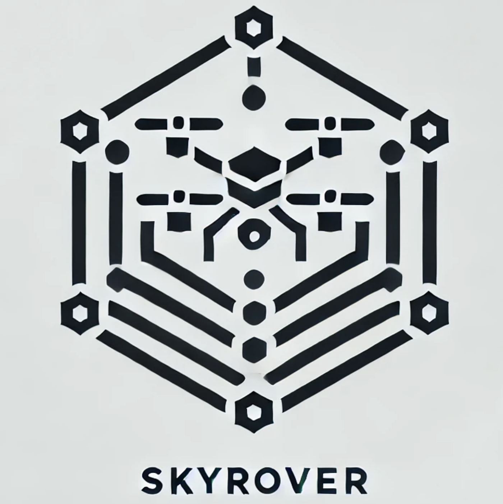

SkyRover
=========

SkyRover, a modular and extensible simulator tailored for cross-domain pathfinding research.

Official Website: https://sites.google.com/view/mapf3d/home

Environment Setup
================

To get started with SkyRover, follow the instructions below to set up your environment.

This project is developed on Ubuntu24.04LTS.

Get the code
-------------

.. code-block:: bash

    mkdir -p ~/ros2_ws/src
    cd ~/ros2_ws/src
    git clone https://github.com/MA-Wenhui/skyrover.git

Install ROS2
-------------

To install ROS2, please follow the official installation guide:

- [ROS2 Installation Guide](https://docs.ros.org/en/jazzy/Installation.html)

Install Gazebo (Harmonic)
-------------

Please follow the official installation guide:

- [Gazebo Harmonic Installation](https://gazebosim.org/docs/harmonic/install_ubuntu/)

Install PX4 (Optional)
-----------------------

PX4 is an optional component for SkyRover, primarily for aerial simulations. If you want to integrate PX4 with SkyRover, follow the instructions below:

1. Download PX4 from [PX4 official site](https://px4.io/).
2. Follow the installation steps specific to your system.

Install Navigation2 (Optional)
-------------------------------

Follow the installation steps to install Navigation2 Stack:

- [Navigation2 Doc](https://docs.nav2.org/development_guides/build_docs/index.html#install)

Train 3D DCC model (or just use pretrained data)
-------------------------------

.. code-block:: bash

    conda create -n skyrover python=3.12
    conda actiavte skyrover
    pip install torch torchvision torchaudio --index-url https://download.pytorch.org/whl/cpu
    pip install ray tensorboard matplotlib
    cd ~/ros2_ws/src/skyrover/skyrover/wrapper
    python -m dcc_3d.train_dcc_3d

Run MAPF 3D
-------------------------------

.. code-block:: bash
    
    # build the skyrover package
    cd ~/ros2_ws/
    colcon build --symlink-install
    source ~/ros2_ws/install/setup.bash

    # open the gz sim, it may takes a while for the first time
    GZ_SIM_RESOURCE_PATH=~/ros2_ws/src/skyrover/skyrover/world/models/:$GZ_SIM_RESOURCE_PATH gz sim ~/ros2_ws/src/skyrover/skyrover/world/warehouse.sdf

    # choose an alg to run
    ros2 run skyrover run_mapf3d --alg 3dcbs --pcd ~/ros2_ws/src/skyrover/skyrover/world/map/map.pcd --pub_gz True
    ros2 run skyrover run_mapf3d --alg 3dastar --pcd ~/ros2_ws/src/skyrover/skyrover/world/map/map.pcd --pub_gz True
    ros2 run skyrover run_mapf3d --alg 3ddcc --pcd ~/ros2_ws/src/skyrover/skyrover/world/map/map.pcd --model ~/ros2_ws/src/skyrover/skyrover/wrapper/dcc_3d/data/65000.pth --pub_gz True

    # run rviz to visualize /mapf_3d_pc topic
    rviz2 ~ros2_ws/src/skyrover/default.rviz 

Cite Our Work
-------------------------------

.. code-block:: bibtex

    @misc{ma2025skyrovermodularsimulatorcrossdomain,
          title={SkyRover: A Modular Simulator for Cross-Domain Pathfinding}, 
          author={Wenhui Ma and Wenhao Li and Bo Jin and Changhong Lu and Xiangfeng Wang},
          year={2025},
          eprint={2502.08969},
          archivePrefix={arXiv},
          primaryClass={cs.RO},
          url={https://arxiv.org/abs/2502.08969}, 
    }
